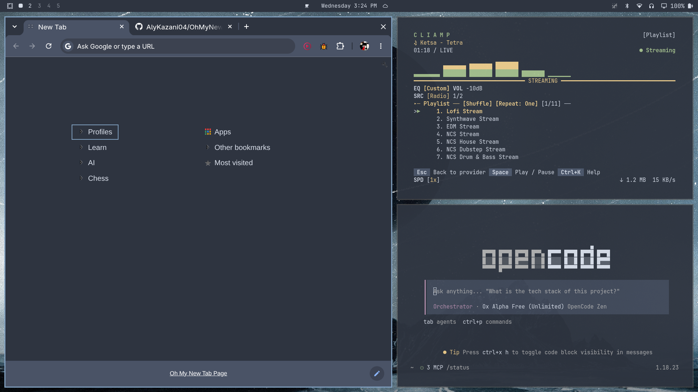
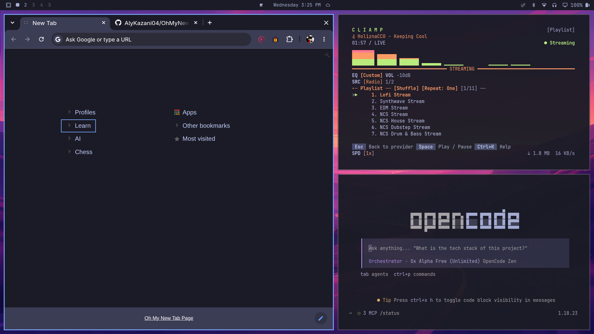
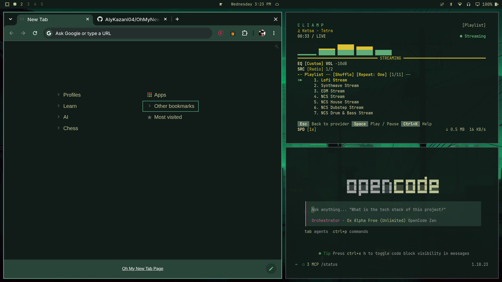
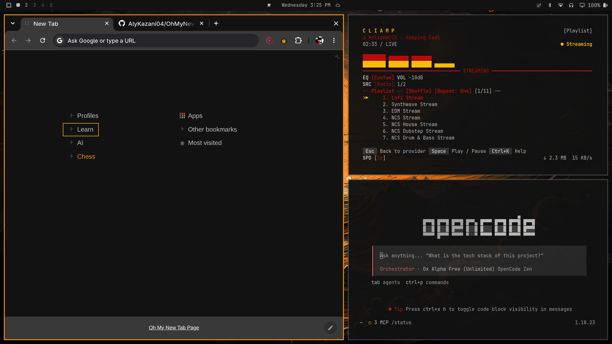

# OhMyNewTabPage

<!--toc:start-->

- [OhMyNewTabPage](#ohmynewtabpage)
  - [Features & Roadmap](#features-roadmap)
  - [Themes](#themes)
    - [Example](#example)
  - [Usage & Navigation](#usage-navigation)
  - [Installation](#installation)
  - [Contributing](#contributing)
  - [License](#license)

<!--toc:end-->

A lightning-fast, keyboard-centric new tab page for power users. This project is a feature-rich fork of the **Humble New Tab Page** extension, with added functionalities and optimized for productivity.

## Features & Roadmap

- [x] **Vim Navigation** — Navigate your bookmarks and links seamlessly using intuitive keyboard shortcuts.
- [x] **Theme Picker** — Switch instantly between popular aesthetic themes (Nord, Catppuccin, Rosé Pine, Tokyo Night, and more).
- [x] **Cut, Copy & Paste for Bookmarks** — Easily rearrange and reorganize your bookmarked links directly from the keyboard or mouse.
- [ ] **Automatic Theme Syncing** — Context-aware theme option that applies colors based on browser's color palette.
- [ ] **Built-in Fuzzy Finder** — Quickly search and filter through all your bookmarks in real time.
- [ ] **Custom Theme Support** — Create, customize, and apply your own custom color palettes.

## Themes

OhMyNewTabPage ships with 14 built-in themes, with inspiration taken from [Omarchy](https://omarchy.org/) — color values are drawn from its theme collection. **Nord** is the default.

| Dark             | Light            |
| :--------------- | :--------------- |
| Nord _(default)_ | Nord Light       |
| Catppuccin       | Catppuccin Latte |
| Rosé Pine        | Rosé Pine Dawn   |
| Tokyo Night      | Tokyo Night Day  |
| Gruvbox          |                  |
| Everforest       |                  |
| Hackerman        |                  |
| Matte Black      |                  |
| Osaka Jade       |                  |
| Solitude         |                  |

Press `T` to open the keyboard-accessible theme picker, or pick a theme in the options panel (`/`).

Note: The themes do not auto-switch on Omarchy.

### Example

**Nord**

**Tokyo Night**

**Osaka Jade**

**Matte Black**

and more...

## Usage & Navigation

Designed with speed in mind, OhMyNewTabPage allows you to stay entirely* on your keyboard.

|         **Key**          | **Action**                                   |
| :----------------------: | :------------------------------------------- |
| `h` or `left arrow (←)`  | Select the column to the left                |
| `l` or `right arrow (→)` | Select the column to the right               |
| `j` or `down arrow (↓)`  | Select the next item                         |
|  `k` or `up arrow (↑)`   | Select the previous item                     |
|      `Enter` or `o`      | Open folder or link                          |
|           `O`            | Open folder only (no-op on links)            |
|           `v`            | Toggle selection (visual mode)               |
|           `V`            | Clear selection                              |
|           `y`            | Yank (copy) selection or item under cursor   |
|           `x`            | Cut selection or item under cursor (dims it) |
|           `p`            | Paste below the item under the cursor        |
|           `P`            | Paste above the item under the cursor        |
|           `n`            | Create a bookmark on the current level       |
|           `N`            | Create a folder on the current level         |
|           `e`            | Edit bookmark or folder                      |
|           `d`            | Delete bookmark or folder (asks to confirm)  |
|           `T`            | Open the theme picker                        |
|           `/`            | Open the options panel (`Esc` closes it)     |
|          `Esc`           | Clear selection / cancel cut                 |

Notes:

- Cut and paste operate on your actual bookmarks, not just the page layout.
  The paste destination follows the cursor's layer: pasting while the cursor
  is inside an open folder puts the item in that folder; pasting on a
  top-level item puts it back at the top level of that column.
- Cut items stay where they are (dimmed) until pasted; `Esc` cancels.
- Copying (`y`) duplicates the whole subtree, including folder contents.
- With the mouse, drop an item directly onto a folder header to move it
  inside that folder — the top and bottom edges of the header keep the
  regular reorder behavior.
- _The options menu navigation is a work in progress._

## Installation

Since the extension isn't on the Chrome Web Store yet, you can easily load the latest release manually:

1. **Download the Release:** Head to the [Releases](https://github.com/AlyKazani04/OhMyNewTabPage/releases) page and download the latest `.zip` package.
2. **Unzip the File:** Extract the contents of the downloaded `.zip` file into a folder on your machine.
3. **Open Extensions Page:** Open Chrome (or any Chromium browser) and navigate to `chrome://extensions/`.
4. **Enable Developer Mode:** Toggle the **Developer mode** switch in the top right corner.
5. **Load Unpacked:** Click the **Load unpacked** button in the top left corner and select the extracted folder.

_Done! Open a new tab to see **OhMyNewTabPage** in action._

## Contributing

Contributions are very welcome! Whether it's reporting a bug, suggesting a feature, or submitting a pull request, your help is appreciated.

Please read our [CONTRIBUTING](/CONTRIBUTING.md) guide for details.

## License

Distributed under the MIT License. See [LICENSE](/LICENSE) for more information.
